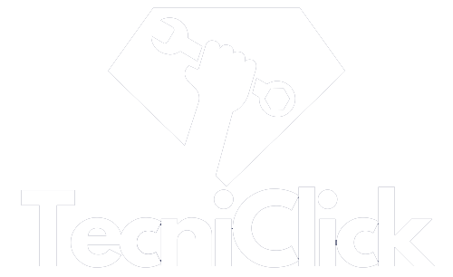
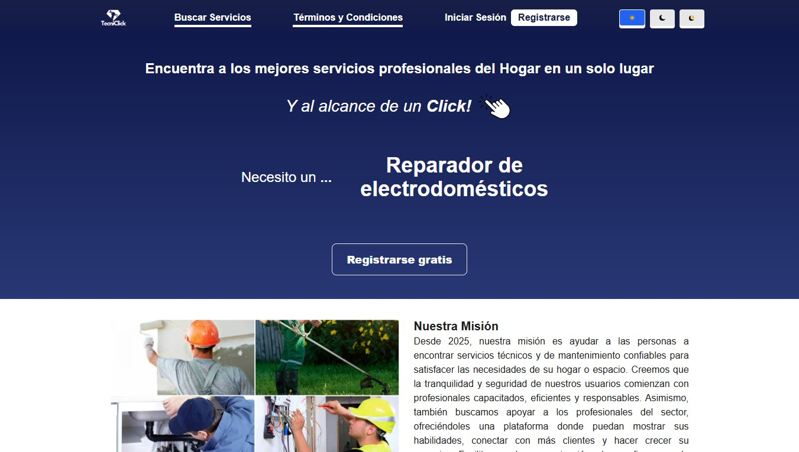
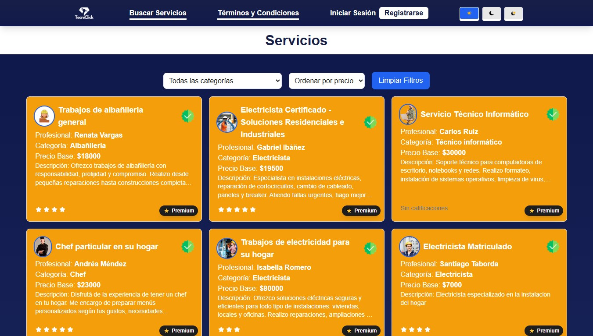
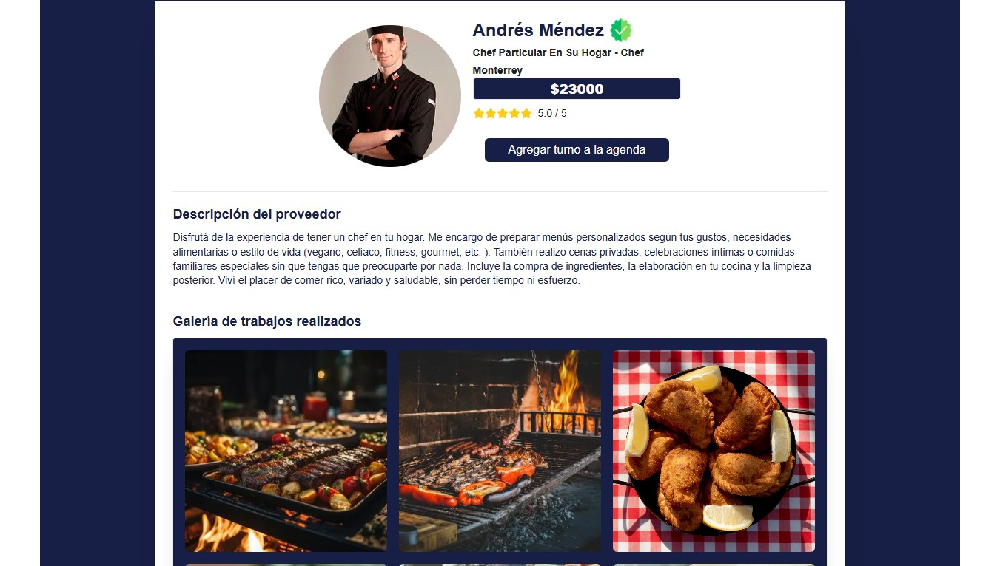
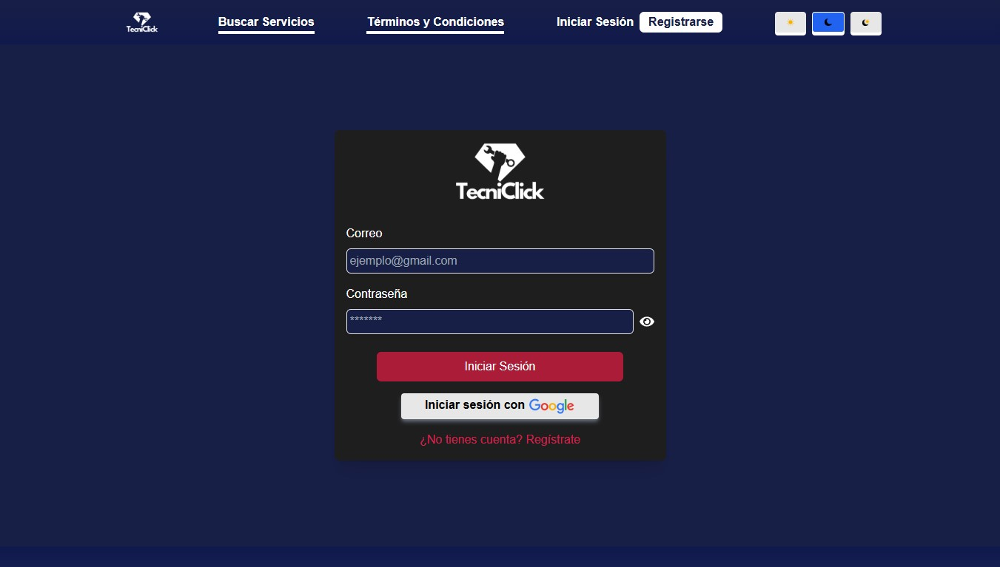

# TecniClick-Proyecto-Final
Este es el proyecto final presentado en Henry, el cual realicé con un gran equipo de trabajo.

  

**Tecniclick** es una plataforma diseñada para mejorar la conexión entre clientes y profesionales del servicio técnico y mantenimiento, revolucionando la forma en que las personas encuentran soluciones para sus hogares y espacios. Dicha plataforma cuenta con algunas funciones destacables:

- Autenticación por terceros (Google).
- Notificaciones (correo de bienvenida, de cancelación, de reservas).
- Almacenamiento en Cloudinary.
- Usuario administrador con su respectivo dashboard.
- Implementación de plataforma de pagos (Stripe).
- Panel de estadísticas y gráficos para usuario administrador.
- Modo oscuro.
- Diseño responsive.
- Feedback.

El proyecto se encuentra deployado y disponible para su visita. También está disponible toda su documentación del back en Swagger:

- https://tecniclickfrontend.vercel.app/
- https://tecniclick-backend.onrender.com/api#/

## Vista previa

  
   
  
   
  
   
  

